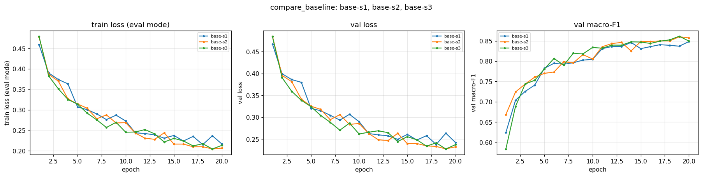
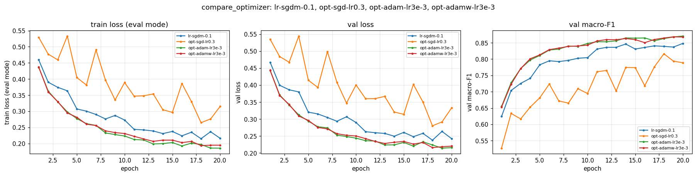
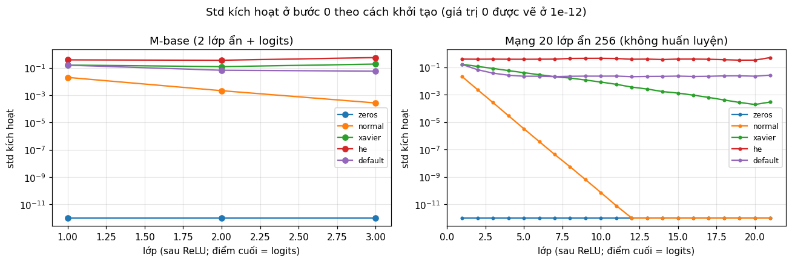

# Báo cáo Lab Day 1 — Le Anh Duy — 2A202602723

## 1. Thiết lập

- **Môi trường:** Google Colab, GPU Tesla T4, PyTorch 2.11.0+cu130. Toàn bộ chạy một lượt từ `code/lab.ipynb` (kế hoạch thí nghiệm trong `code/experiments.yaml`), tổng khoảng 19 phút huấn luyện cho 39 lần chạy.
- **Dữ liệu:** Forest CoverType; `train` 464 809 / `eval` 116 203 theo `split_metadata.csv`. Validation: 20% của train (phân tầng, seed 42) → 371 847 train / 92 962 val. Chuẩn hoá 10 cột số bằng mean/std của phần train còn lại; 44 cột one-hot giữ nguyên. Train loss đo ở chế độ `eval()` trên một tập con cố định 50 000 mẫu của train.
- **Model:** `M-base` (54→256→128→7, 47 879 tham số). Baseline: cross-entropy, SGD+momentum 0.9, **lr 0.1** (chọn bằng val, mục 2), batch 512, 20 epoch, khởi tạo He (`kaiming_normal_`, bias 0), không dropout/clip, FP32. Metric báo cáo ở epoch có val loss thấp nhất.
- **Mốc tham chiếu:** accuracy "đoán lớp đa số" trên val = 0.4876.
- **Các chủ đề đã thử:** ☑ loss ☑ optimizer ☑ hyper-parameter ☑ dropout ☑ clipping ☑ mixed precision ☑ init

## 2. Kiểm tra ban đầu và độ nhiễu

| Kiểm tra | Kết quả |
|---|---|
| Số tham số / shape logits | 47 879 / (B, 7) |
| Loss bước 0 (so với ln 7 = 1.946) | 2.269 (He); 1.946 với init `normal` |
| Quá khớp 20 mẫu: loss cuối | 8.6e-7 sau 500 bước Adam, accuracy 100% |
| Mọi tham số có gradient khác 0 | ☑ có (grad norm W1…b3 từ 0.34 đến 2.02) |
| Baseline, số seed đã chạy | 3 (`base-s1`, `base-s2`, `base-s3`) |
| Baseline: val acc (TB ± σ) | 0.9082 ± 0.0024 |
| Baseline: val macro-F1 (TB ± σ) | 0.8535 ± 0.0126 |

**Ngưỡng nhiễu dùng trong báo cáo:** 2σ = **0.025** (val macro-F1).

Loss bước 0 cao hơn ln 7 vì He (Var = 2/n_in) áp dụng cả cho lớp ra không có ReLU, nên logits có std ≈ 0.58 và softmax lệch khỏi phân bố đều. Đây không phải lỗi code: với init `normal`, loss bước 0 đúng bằng 1.946.

Chọn lr baseline (`lr-sgdm-*`): 0.003 → 0.665, 0.01 → 0.761, 0.03 → 0.817, **0.1 → 0.839** (val macro-F1). Đường cong `base-s1` (`figures/base-s1.png`) cho thấy train loss và val loss gần trùng nhau (gap 0.026), cả hai vẫn còn giảm ở epoch 20, best epoch 18–20 ở cả 3 seed. Như vậy baseline **chưa khớp đủ**, chưa có dấu hiệu quá khớp.

σ khá lớn chủ yếu vì `base-s1` thấp bất thường (0.839, trong khi s2 và s3 là 0.860 và 0.861). Mọi thí nghiệm ở mục 3 đều chạy seed 1. Vì vậy mỗi kết quả được so theo hai cách: (i) so với trung bình 3 seed và ngưỡng 2σ (cột `beyond_noise` trong bảng); (ii) so cùng seed với `base-s1`. Chỉ cách (i) được coi là bằng chứng.

## 3. Kết quả theo chủ đề

### 3.1 Hàm mất mát — CE vs MSE
- **Dự đoán:** CE tốt hơn MSE. Gradient của CE theo logit là `p − y`, vẫn lớn khi mô hình đoán sai nặng; MSE trên logit (trung bình trên B×7 phần tử, như `nn.MSELoss`) cho gradient nhỏ và không ép xác suất lớp đúng.
- **Kết quả:** `loss-mse` 0.728 (acc 0.871) so với CE `base-s1` 0.839; thấp hơn trung bình baseline 0.126, **vượt 2σ**. `loss-mse-lrx10` (lr 1.0) còn tệ hơn: 0.599. Ảnh: `figures/compare_loss.png`.
- **Giải thích:** grad norm trung bình của MSE là 0.087, của CE là 0.567, tức nhỏ hơn khoảng 6.5 lần. Vì vậy MSE học chậm: ở epoch 5, MSE đạt F1 0.616 trong khi CE đã 0.782. Tăng lr ×10 không bù được mà còn tạo gai gradient (max 14.2) và dao động. Vấn đề nằm ở hình dạng hàm mất mát chứ không chỉ ở độ lớn gradient. Do hai loss khác thang đo, chỉ so accuracy và macro-F1, không so giá trị loss.

### 3.2 Bộ tối ưu hoá
- **Dự đoán:** khi lr được chỉnh công bằng, Adam/AdamW hội tụ nhanh hơn SGD+momentum, SGD thuần chậm nhất. AdamW ≈ Adam vì mô hình chưa quá khớp.
- **Mỗi bộ tối ưu ở lr tốt nhất của nó** (mỗi bộ thử 3–4 lr):

| exp_id | optimizer | lr | val macro-F1 | best epoch |
|---|---|---|---|---|
| `opt-sgd-lr0.3` | SGD | 0.3 | 0.816 | 18 |
| `lr-sgdm-0.1` | SGD+momentum 0.9 | 0.1 | 0.839 | 18 |
| `opt-adam-lr3e-3` | Adam (β = 0.9, 0.999; ε = 1e-8) | 3e-3 | **0.868** | 19 |
| `opt-adamw-lr3e-3` | AdamW (wd 0.01) | 3e-3 | 0.865 | 18 |

- **Độ nhạy với lr:** mọi bộ đều rất nhạy. Adam đạt 0.788 / 0.846 / 0.868 với lr 3e-4 / 1e-3 / 3e-3; SGD+momentum đạt 0.665 → 0.839 khi lr đi từ 0.003 → 0.1. SGD thuần dao động mạnh (val loss epoch cuối 0.333 so với mức tốt nhất 0.280).
- **Giải thích:** Adam lên nhanh ngay từ đầu (F1 epoch 5 / 10: 0.811 / 0.848, so với 0.782 / 0.805 của SGD+momentum) vì bước cập nhật được chia theo √v̂ của từng tham số, nên các tham số có gradient nhỏ vẫn đi được bước đáng kể. Momentum tích luỹ vận tốc, tương đương lr hiệu dụng lớn hơn khoảng 1/(1−μ), nên SGD thuần cần lr lớn hơn mà vẫn kém hơn. Adam hơn trung bình baseline 0.014, **chưa vượt 2σ** (so cùng seed với `base-s1` là +0.029). SGD thuần thấp hơn trung bình 0.037, **vượt 2σ**. Adam và AdamW chênh 0.003, nằm trong nhiễu.

### 3.3 Hyper-parameter
Ảnh: `figures/compare_batch.png`, `figures/compare_hparam.png`.

| exp_id | thay đổi | val F1 | Δ so với TB baseline | s/epoch |
|---|---|---|---|---|
| `hp-bs128` | batch 128 (×4 số bước) | 0.856 | +0.003 | 5.11 |
| `hp-bs2048` | batch 2048 (¼ số bước) | 0.797 | −0.057 (vượt 2σ) | 0.33 |
| `hp-bs2048-lrx4` | batch 2048 + lr 0.4 (đổi 2 yếu tố) | 0.846 | −0.008 | 0.34 |
| `hp-wide` | 512-256 | 0.874 | +0.020 | 1.29 |
| `hp-deep` | 256-128-64 | 0.865 | +0.011 | 1.48 |
| `hp-wd5e-4` | weight decay 5e-4 | 0.750 | −0.104 (vượt 2σ) | 1.34 |
| `hp-cosine` | cosine lr → 0 | 0.866 | +0.013 | 1.30 |

- Cùng 20 epoch, batch 2048 chỉ có ¼ số bước cập nhật nên chưa học xong. Tăng lr ×4 theo quy tắc tăng lr theo lô bù được gần hết, vì tổng quãng đường cập nhật tương đương. Batch 128 có gấp 4 lần số bước nhưng chậm gấp 4 lần mỗi epoch (thời gian tỉ lệ với số bước vì mạng nhỏ) và không tốt hơn ngoài nhiễu.
- M-wide, M-deep và cosine đều tốt hơn (so cùng seed với `base-s1`: +0.035 / +0.026 / +0.027; train loss thấp hơn), nhất quán với việc baseline chưa khớp đủ. Tuy nhiên chưa cái nào vượt 2σ so với trung bình. Weight decay làm mô hình vốn đang thiếu khớp càng thiếu khớp (train loss 0.323 so với 0.216).

### 3.4 Dropout
- **Dự đoán:** baseline không quá khớp (gap 0.026) nên dropout sẽ làm giảm F1.
- **Kết quả** (`drop-0.1/0.3/0.5`, `figures/compare_dropout.png`): gap val − train giảm 0.026 → 0.014 → 0.010 → 0.007, nhưng train loss tăng 0.216 → 0.234 → 0.305 → 0.394. val F1 lần lượt 0.840 (trong nhiễu), 0.788 và 0.681 (hai mức sau vượt 2σ).
- **Giải thích:** dropout giảm năng lực hiệu dụng và làm gradient nhiễu hơn. Gap nhỏ đi là vì train loss tăng lên chứ val loss không giảm. Mô hình này **không** quá khớp, nên dropout là thuốc sai bệnh. Lớp hiếm chịu thiệt nhất: macro-F1 giảm nhanh hơn accuracy.

### 3.5 Gradient clipping
- **Chọn c:** grad norm trung bình theo epoch của `base-s1` dao động 0.53–0.59. Lấy c = 0.57 (trung vị) để clipping thực sự kích hoạt.
- **Ở lr bình thường** (`clip-c`): cắt 34% số bước ở epoch 1 và khoảng 65% về sau, nhưng val F1 0.854 ≈ trung bình baseline (trong nhiễu). Khi huấn luyện đã ổn định, clipping chỉ tương đương với giảm nhẹ lr.
- **Ở lr cao** (lr 1.0 = ×10): bản không clip (`noclip-lrx10`) **không phân kỳ** nhưng dao động. Gai grad norm lên 9.7 ở epoch 1 và 1.22 ở epoch cuối; val loss tăng ngược 0.333 → 0.371 ở epoch cuối; F1 0.773. Bản có clip (`clip-c-lrx10`) có gai lớn nhất (đo trước khi cắt) là 3.26 ở epoch 1 và ≤ 0.83 về sau; F1 0.805, cao hơn bản không clip 0.031 (≈ 2σ, mới có 1 seed nên là bằng chứng yếu).
- **Bất ngờ:** ở lr 1.0, grad norm trung bình chỉ khoảng 0.25, thấp hơn ở lr 0.1. Vì vậy c = 0.57 hầu như chỉ kích hoạt ở epoch 1 (khoảng 2% số bước). Lợi ích đến từ việc chặn các gai đầu tiên, ngăn mô hình bị đẩy vào vùng xấu ngay từ đầu. Ảnh: `figures/compare_clipping.png`.

### 3.6 Mixed precision

| | s/epoch | peak mem (MB) | val macro-F1 |
|---|---|---|---|
| FP32 (`base-s1`) | 1.29 | 176 | 0.839 |
| FP16 + GradScaler (`amp-fp16`) | 1.78 | 176 | 0.848 |
| BF16 (`amp-bf16`) | 1.53 | 176 | 0.847 |

- Mixed precision **chậm hơn** trên T4 (FP16 +38%, BF16 +18%). GEMM quá nhỏ (512×54×256) nên Tensor Core không có lợi; chi phí autocast và GradScaler (`scale`, `unscale_`, `step`, `update` mỗi bước) lại thêm vào. T4 (Turing) không có phần cứng BF16 gốc.
- Bộ nhớ không đổi vì gần như toàn bộ là dữ liệu FP32 đặt sẵn trên GPU; activation của một lô chưa tới 1 MB.
- Độ chính xác ngang FP32 (trong nhiễu): tham số và loss vẫn ở FP32. FP16 cần nhân loss với hệ số s vì khoảng biểu diễn hẹp (min normal khoảng 6e-5, gradient nhỏ dễ thành 0); BF16 có 8 bit số mũ như FP32 nên không cần.

### 3.7 Khởi tạo tham số

| init | std ReLU1 / ReLU2 / logits (bước 0) | loss bước 0 | val F1 |
|---|---|---|---|
| zeros (`init-zeros`) | 0 / 0 / 0 | 1.946 | 0.094 |
| normal 0.01 (`init-normal`) | 0.020 / 0.0022 / 0.00027 | 1.946 | 0.845 |
| xavier_normal_ (`init-xavier`) | 0.16 / 0.12 / 0.19 | 2.022 | 0.851 |
| he (`base-s1`) | 0.39 / 0.37 / 0.58 | 2.269 | 0.839 |
| default nn.Linear (`init-default`) | 0.16 / 0.068 / 0.059 | 1.983 | 0.860 |

- **zeros:** mọi nơ-ron trong cùng lớp giống hệt nhau, ReLU(0) = 0, và W lớp ra bằng 0 nên các lớp ẩn không nhận gradient. Chỉ bias lớp ra học được, và nó học đúng tỉ lệ lớp. Bằng chứng: val loss đứng ở **1.205 = entropy của phân bố nhãn**; acc 0.4876 và F1 0.094 đúng bằng mốc "đoán lớp đa số".
- **normal 0.01:** mỗi lớp nhân phương sai với khoảng n·0.01² ≪ 1, nên kích hoạt tắt dần (ở mạng 20 lớp, về 0 sau khoảng 12 lớp). Ở mạng 3 lớp, nó chỉ học chậm hơn lúc đầu (F1 epoch 5: 0.752 so với 0.782).
- Với mạng 20 lớp, He giữ std ổn định. Xavier giảm dần vì với lớp 256→256, Var = 2/(n_in + n_out) chỉ bằng một nửa mức 2/n_in mà ReLU cần. M-base chỉ có 3 lớp nên normal, xavier và default đều nằm trong nhiễu so với He.

## 4. Đánh giá cuối trên tập eval

| Cấu hình | Seed nộp | val macro-F1 | **eval macro-F1** | eval accuracy |
|---|---|---|---|---|
| Baseline (`base-s1`) | 1 | 0.8390 | **0.8410** | 0.9033 |
| Cấu hình cuối (`final-s1`) | 1 | 0.8894 | **0.8909** | 0.9280 |

- **Cấu hình cuối:** Adam lr 3e-3, M-base, CE, batch 512, 40 epoch, không dropout. Nó được chọn tự động **chỉ bằng val** theo quy tắc trong `experiments.yaml`:
  - optimizer/lr lấy từ lần chạy có val F1 cao nhất (`opt-adam-lr3e-3`);
  - M-wide, cosine và dropout chỉ được thêm nếu vượt trung bình baseline hơn 2σ, và không cái nào đạt;
  - 40 epoch thay cho 20 vì mọi lần chạy 20 epoch đều có best epoch ở gần cuối.
- **Hai seed của cấu hình cuối:** val F1 `final-s1` 0.889 và `final-s2` 0.892, tức 0.8907 ± 0.0018, cao hơn baseline 0.8535 ± 0.0126 là **+0.037 > 2σ**. Trên eval, `final-s1` hơn `base-s1` 0.050. Vì `base-s1` là seed baseline thấp nhất, con số 0.050 phóng đại phần cải thiện; ước lượng công bằng hơn là khoảng +0.037 theo val. Mình chỉ chấm eval cho seed nộp, nên không có σ trên eval.
- **Val và eval gần nhau:** lệch +0.002 (baseline) và +0.0015 (final), nên val là ước lượng đáng tin của eval.

### 4.1 Phân tích lỗi theo lớp (`eval_result.json`, `final-s1`)

| Lớp | support | precision | recall | F1 | F1 baseline |
|---|---|---|---|---|---|
| 0 Spruce/Fir | 42 368 | 0.928 | 0.920 | 0.924 | 0.902 |
| 1 Lodgepole Pine | 56 661 | 0.936 | 0.942 | 0.939 | 0.920 |
| 2 Ponderosa Pine | 7 151 | 0.927 | 0.928 | 0.927 | 0.891 |
| 3 Cottonwood/Willow | 549 | 0.861 | 0.802 | 0.830 | 0.777 |
| 4 Aspen | 1 899 | 0.875 | 0.767 | **0.817** | 0.718 |
| 5 Douglas-fir | 3 473 | 0.848 | 0.889 | 0.868 | 0.787 |
| 6 Krummholz | 4 102 | 0.929 | 0.932 | 0.931 | 0.894 |

- **Lớp khó nhất là lớp 4 (Aspen), F1 = 0.817**, recall chỉ 0.767. Trong 1 899 mẫu, nó bị nhầm với **lớp 1** 348 lần và với lớp 0 61 lần. Lý do:
  - lớp này chỉ có 1.6% số mẫu (6 075 mẫu train);
  - độ cao trung bình của nó (khoảng 2 790 m) nằm giữa lớp 0 (khoảng 3 130 m) và lớp 1 (khoảng 2 920 m);
  - nó xuất hiện cùng wilderness area với hai lớp lớn này, nên khi đặc trưng chồng lấn, mô hình bị kéo về lớp đa số.
- **Lớp 3 (0.5%) nhầm sang lớp 2 và lớp 5:** ba lớp này cùng ở vùng thấp (khoảng 2 220–2 420 m) và tập trung ở Wilderness_Area_3.
- **Cặp nhầm nhiều nhất về số lượng là 0 ↔ 1** (3 084 + 2 743 mẫu). Hai lớp này chiếm 85% dữ liệu và có dải độ cao trùng nhau.
- So với baseline, cấu hình cuối cải thiện nhiều nhất ở các lớp hiếm (lớp 4 +0.099, lớp 5 +0.082, lớp 3 +0.053), trong khi lớp 1 chỉ +0.019.
- **Cách cải thiện sẽ thử:** cross-entropy có trọng số lớp hoặc focal loss để tăng recall cho lớp 3 và 4; kết hợp thêm M-wide và nhiều epoch hơn.

## 5. Trả lời các câu hỏi dẫn dắt

1. **Bộ tối ưu nào thắng khi chỉnh lr công bằng?** Adam (0.868 ở lr 3e-3) ≈ AdamW (0.865) > SGD+momentum (0.839 ở lr 0.1) > SGD (0.816 ở lr 0.3). Khoảng cách giữa Adam và SGD+momentum chưa vượt 2σ so với trung bình baseline. Khi không chỉnh lr, kết luận có thể đảo ngược: Adam ở lr 3e-4 (0.788) thua SGD+momentum ở lr 0.1, và SGD ở lr 0.1 (0.755) thua SGD+momentum ở cùng lr. "Adam thắng" chỉ có nghĩa khi đặt cạnh lr tốt nhất của từng bộ.
2. **Dropout có giúp khi mô hình chưa quá khớp không?** Không. Ở đây dropout chỉ thu hẹp gap bằng cách làm train loss tăng, còn F1 giảm theo q. Chỉ nên dùng khi train loss thấp hơn hẳn val loss và val loss bắt đầu tăng (tức là quá khớp), ví dụ với mạng lớn hơn nhiều hoặc dữ liệu ít.
3. **Gradient clipping giải quyết vấn đề gì?** Nó chặn các bước cập nhật quá lớn do gai gradient. Bằng chứng: ở lr 1.0, bản không clip có gai 9.7 và val loss tăng ngược ở cuối, còn bản có clip chặn gai đầu (3.26 trước khi cắt) và đạt F1 cao hơn 0.031. Ở lr bình thường, clipping không giúp gì vì không có gai cần chặn.
4. **Mixed precision có nhanh hơn không?** Không. Trên T4 với mạng 48K tham số, FP16 và BF16 chậm hơn 18–38%: thời gian bị chi phối bởi chi phí gọi kernel và ép kiểu, không phải phép nhân ma trận. Bộ nhớ cũng không giảm vì phần lớn là dữ liệu.
5. **Vì sao khởi tạo 0 hỏng? He khác Xavier ở đâu?** Khởi tạo 0 làm mọi nơ-ron đối xứng và ReLU(0) = 0, nên gradient của các lớp ẩn bằng 0; chỉ bias lớp ra học được, dẫn đến đoán lớp đa số (`init-zeros`). He dùng Var = 2/n_in để bù việc ReLU bỏ một nửa phương sai; Xavier dùng 2/(n_in + n_out), thiết kế cho hàm kích hoạt đối xứng. Với ReLU, Xavier làm std kích hoạt giảm dần theo độ sâu (thấy rõ ở mạng 20 lớp). Sự khác biệt chỉ quan trọng ở mạng sâu; với mạng 3 lớp thì không đáng kể.
6. **Loss không giảm sau 2 000 bước — 3 phép kiểm tra đầu tiên:**
   1. **Loss bước 0 có ≈ ln C không?** Nếu cao hơn nhiều, khởi tạo hoặc chuẩn hoá đầu vào có vấn đề. Ví dụ ở đây: 2.27 với He, 1.946 với normal.
   2. **Có quá khớp được một lô nhỏ (20 mẫu) với mọi chính quy hoá tắt không?** Nếu không, gần như chắc chắn là lỗi code: nhãn lệch, softmax hai lần, quên `zero_grad`, tham số không nằm trong optimizer. Ở đây loss về 8.6e-7.
   3. **Gradient có chảy tới mọi tham số không, và grad norm có hợp lý không?** In grad norm của từng lớp: bằng 0 nghĩa là gradient không chảy (như `init-zeros`: grad norm khoảng 0.03, loss đứng ở entropy nhãn); quá nhỏ nghĩa là lr quá thấp (như `lr-sgdm-0.003`: sau 20 epoch F1 vẫn chỉ 0.665); có gai lớn thì nên giảm lr hoặc clip.

   Ba phép này rẻ, mỗi phép chạy dưới một phút, và tách được lỗi dữ liệu/code khỏi lỗi tối ưu hoá trước khi tốn thời gian chỉnh hyper-parameter.

## 6. Hạn chế và điều bất ngờ

- **Khác dự đoán:**
  - MSE với lr ×10 tệ hơn chứ không tốt hơn.
  - lr ×10 không làm huấn luyện phân kỳ.
  - Ở lr cao, grad norm lại nhỏ hơn, nên c chọn theo baseline gần như không kích hoạt.
  - Mixed precision chậm hơn (dự đoán là không nhanh hơn, nhưng không nghĩ sẽ chậm tới 38%).
- **Có thể làm kết luận sai:**
  - Chỉ có 3 seed baseline, và seed 1 (dùng cho mọi thí nghiệm) là seed thấp nhất. σ vì thế là ước lượng thô, và các chênh lệch "cùng seed" có thể phóng đại.
  - Mỗi thí nghiệm chỉ chạy 1 seed.
  - lr tốt nhất của **mọi** bộ tối ưu đều ở biên trên của lưới, nên có thể chưa phải lr tối ưu.
  - Mọi cấu hình 20 epoch đều chưa hội tụ, nên so sánh có phần thiên về "học nhanh" hơn là "điểm hội tụ tốt".
  - Cấu hình cuối kết hợp kiểu tham lam và chưa thử kết hợp M-wide/cosine với Adam.
  - Thí nghiệm `hp-bs2048-lrx4` đổi 2 yếu tố cùng lúc.
  - Phần "dự đoán" trong báo cáo và notebook được viết dựa trên lý thuyết, sau khi pipeline đã chạy một lượt.
- **Nếu có thêm thời gian:**
  - mở rộng lưới lr (SGD+momentum 0.3, Adam 1e-2);
  - chạy mỗi thí nghiệm với 3 seed;
  - làm lại thí nghiệm clipping với lr ×30 và c chọn theo grad norm ở lr cao;
  - thử weighted CE / focal loss cho lớp 3 và 4;
  - thử Adam + M-wide + cosine + 60 epoch.

## 7. Phụ lục

- **File đã nộp:** `REPORT.md`, `experiments.xlsx` (39 dòng; sheet Seeds gồm `base-s1..3`; sheet Summary có nhận xét), `predictions_eval.csv` (`final-s1`), `eval_result.json`, `figures/` (39 ảnh `<exp_id>.png` và 12 ảnh `compare_*.png`), `results/` (39 file JSON), `eval_baseline/` (dự đoán và kết quả eval của `base-s1`, dùng cho mục 4), `code/` (`lab.ipynb` còn output, `data.py`, `model.py`, `optimizer.py`, `train.py`, `plots.py`, `results_table.py`, `runner.py`, `experiments.yaml`).
- **Thời gian chạy:** khoảng 19 phút huấn luyện (tổng thời gian epoch của 39 lần chạy) trên T4, khoảng 25 phút cho cả notebook.
